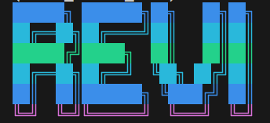
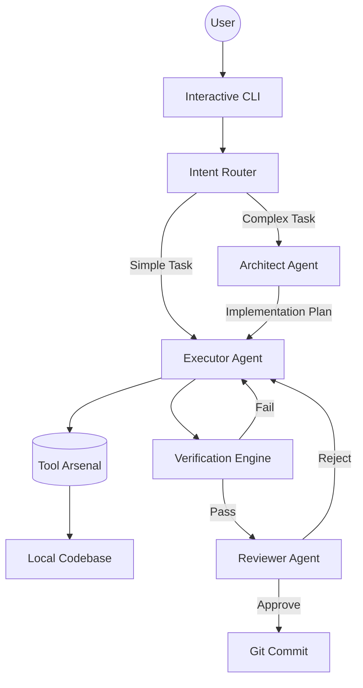

<div align="center">
  
  <h1>⚡ REVI ⚡</h1>
  <p><strong>A Production-Grade, Autonomous AI Software Engineer</strong></p>
  <p>
    <a href="#features">Features</a> •
    <a href="#architecture">Architecture</a> •
    <a href="#installation">Installation</a> •
    <a href="#usage">Usage</a> •
    <a href="#slash-commands">Slash Commands</a>
  </p>
</div>

---

## 🚀 Overview

**REVI** (formerly *kinda_claude_code*) is an advanced, autonomous AI coding agent designed to operate with the systematic rigor of a Senior Software Engineer. Unlike standard chatbots or basic coding assistants that just generate code snippets, REVI takes ownership of complete development cycles: it understands the codebase, plans architecture, executes module-by-module, automatically verifies its own work, and commits the changes.

Powered by Groq for high-speed inference and built with a robust multi-agent methodology, REVI handles complex refactoring, feature implementation, and codebase exploration autonomously.

---

## ✨ Key Features

### 🧠 The "Codebase Brain"
REVI doesn't just read files; it *understands* your project.
- **Deep Scanning**: Processes code (AST parsing), models, data, scripts, configs, and directory structures.
- **Persistent Knowledge**: Builds a `codebase_brain.md` document and vector index, retaining knowledge across sessions.
- **Contextual Awareness**: Automatically injects a compact project map into the LLM context, ensuring it always knows where things are without re-reading.

### 🛡️ Auto-Verification & Self-Healing
REVI never hands back broken code. After modifying files, it automatically runs:
- **Compile Checks**: Ensures all Python files compile cleanly.
- **Import Resolution**: Validates that all local imports resolve to actual modules.
- **Linting**: Runs `ruff` to catch syntax and style errors.
- **Test Suite**: Automatically detects and runs project tests.
- **Self-Healing Loop**: If verification fails, REVI analyzes the traceback and feeds it back into an internal fix loop until the code passes.

### 📋 Systematic 5-Phase Methodology
REVI is hard-coded to follow a strict engineering workflow:
1. **UNDERSTAND**: Reads AST maps, files, and references before touching anything.
2. **PLAN**: Engages the internal **Architect Agent** to decompose tasks into structured phases.
3. **BUILD**: Implements changes module-by-module, linting after every edit.
4. **VERIFY**: Runs full project verification (`/verify`).
5. **COMMIT**: Creates structured, conventional git commits.

### 👥 Multi-Agent Architecture
- **Executor (REVI)**: The primary agent that routes intents and executes tools.
- **Architect**: Engaged for medium/complex tasks. It deeply analyzes the codebase and generates a step-by-step implementation plan.
- **Reviewer**: Inspects actual `git diffs` of REVI's work and provides critical feedback, forcing corrections before a task is considered complete.

### 🛠️ Extensive Tool Arsenal (38 Tools)
Equipped with a massive suite of capabilities, including:
- **LSP Navigation**: Find references, jump to definitions, get call graphs, find implementations.
- **File Operations**: Precision editing, batch scaffolding, semantic search.
- **Execution**: Run shell commands, start background servers, interact with Docker sandboxes.
- **Memory**: Task scratchpads, goal setting, persistent user preferences.

---

## 🏗️ Architecture

REVI's core loop (`agent.py`) routes user intents to dynamically select relevant tools, optimizing token usage.



---

## 📦 Installation

1. **Clone the repository:**
   ```bash
   git clone https://github.com/Ayushhgit/Claude_code_lite.git
   cd Claude_code_lite
   ```

2. **Set up the virtual environment:**
   ```bash
   uv venv
   source .venv/bin/activate  # On Windows: .venv\Scripts\activate
   ```

3. **Install dependencies:**
   ```bash
   uv pip install -r requirements.txt
   ```

4. **Environment Variables:**
   Create a `.env` file in the root directory:
   ```env
   GROQ_API_KEY=your_groq_api_key_here
   MODEL=llama3-70b-8192  # Or your preferred Groq model
   ```

---

## 🚀 Usage

Start REVI by running the main interface:

```bash
uv run src/main.py
```

Upon startup, REVI will detect the active project, load its persistent memory, initialize tools, and present an interactive prompt.

**Example Workflows:**
- *"Scan the codebase and explain the architecture."*
- *"Implement a new authentication middleware in the backend, plan it out first."*
- *"Find all references to `calculate_total` and update the function signature."*
- *"Run tests, fix any failing ones, and commit the changes."*

---

## ⌨️ Slash Commands

Use these commands directly in the REVI prompt for quick actions:

| Command | Description |
| :--- | :--- |
| `/help` | Show all available commands |
| `/scan` | Deep scan the codebase and build the persistent brain document |
| `/verify` | Run full project verification (compile, imports, lint, tests) |
| `/map` | Show the AST-based codebase architecture map |
| `/plan` | Show the active execution plan created by the Architect |
| `/tasks` | View the current task scratchpad |
| `/status` | Show session statistics (turns, tokens, git branch) |
| `/compact` | Force-compact context to save tokens |
| `/clear` | Reset context window and start fresh |
| `/sandbox` | Show Docker sandbox status |
| `/diff` | Show uncommitted git changes |
| `/commit` | Auto-commit all current changes |
| `/undo` | Git soft-reset the last commit |
| `/git <cmd>`| Run any git command directly (e.g., `/git log -5`) |
| `exit` | Quit the agent |

---

## 📁 Workspace Artifacts

REVI maintains state in a `.kinda_claude/` directory within your project:
- `codebase_brain.md` / `.json`: Deep codebase understanding.
- `scratchpad.md`: Active task lists and goals.
- `current_plan.json`: Active multi-step plans.
- `chroma_db/`: Vector database for semantic code search.
- `.agent_memory.md` (root level): Persistent user preferences and critical context.

*Note: Add `.kinda_claude/` to your `.gitignore`.*

---

<div align="center">
  <i>Built to engineer, not just chat.</i>
</div>
